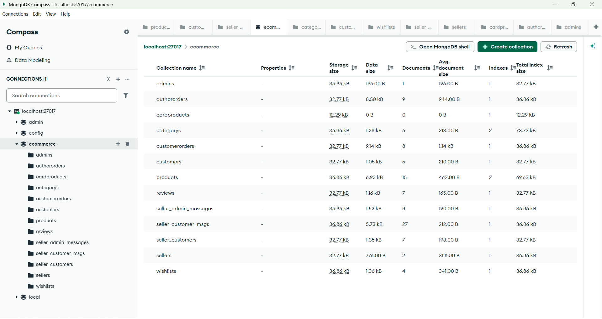

# Ecommerce Backend

An Express.js/MongoDB backend for a multi-role ecommerce platform supporting customers, sellers, and admins. Features include authentication, product management, order processing, chat, and more.

## Table of Contents

- [Ecommerce Backend](#ecommerce-backend)
  - [Table of Contents](#table-of-contents)
    - [Database Architecture](#database-architecture)
  - [Project Overview](#project-overview)
  - [Features](#features)
  - [Technologies Used](#technologies-used)
  - [Installation \& Setup](#installation--setup)
  - [Usage](#usage)
  - [Project Structure](#project-structure)
  - [API Endpoints](#api-endpoints)
    - [Auth](#auth)
    - [Customer](#customer)
    - [Products](#products)
    - [Categories](#categories)
    - [Sellers](#sellers)
    - [Orders](#orders)
    - [Cart \& Wishlist](#cart--wishlist)
    - [Reviews](#reviews)
    - [Chat](#chat)

---

### Database Architecture



## Project Overview

This backend powers an ecommerce platform with:

- Customer, seller, and admin roles
- Product, category, and order management
- Authentication and authorization
- Real-time chat (Socket.io)
- Wishlist, reviews, and dashboard features

## Features

- User authentication (JWT, cookies)
- Admin and seller login/logout
- Customer registration/login/logout
- Product CRUD (add, update, get, image upload)
- Category CRUD
- Order placement and tracking
- Cart and wishlist management
- Review system
- Real-time chat between customers, sellers, and admin

## Technologies Used

- Node.js, Express.js
- MongoDB, Mongoose
- Socket.io
- JWT, bcrypt, cookie-parser
- Cloudinary (image upload)
- Stripe (payments)
- dotenv, cors, body-parser

## Installation & Setup

1. Clone the repository:
   ```bash
   git clone <repo-url>
   cd backend
   ```
2. Install dependencies:
   ```bash
   npm install
   ```
3. Create a `.env` file with your MongoDB URI and other secrets:
   ```env
   DB_URL=your_mongodb_uri
   JWT_SECRET=your_jwt_secret
   CLOUDINARY_URL=your_cloudinary_url
   STRIPE_SECRET=your_stripe_secret
   ```
4. Start the development server:
   ```bash
   npm run server
   ```

## Usage

- The server runs on `http://localhost:5000` (or as configured)
- Connect your frontend to the backend API endpoints

## Project Structure

```
backend/
│   server.js
│   package.json
│   .env
│   README.md
├── controllers/
├── middlewares/
├── models/
├── routes/
├── utiles/
```

- `controllers/` — Business logic for each feature
- `models/` — Mongoose schemas for MongoDB
- `routes/` — Express route definitions
- `middlewares/` — Auth and other middleware
- `utiles/` — Utility functions (DB, tokens, responses)

## API Endpoints

### Auth

- `POST /api/auth/admin-login` — Admin login
- `POST /api/auth/seller-login` — Seller login
- `POST /api/auth/seller-register` — Seller registration
- `GET /api/auth/get-user` — Get current user (auth required)
- `GET /api/auth/logout` — Logout (auth required)

### Customer

- `POST /api/home/customer/customer-register` — Register customer
- `POST /api/home/customer/customer-login` — Customer login
- `GET /api/home/customer/logout` — Customer logout

### Products

- `POST /api/dashboard/product-add` — Add product (seller)
- `GET /api/dashboard/products-get` — Get all products
- `GET /api/dashboard/product-get/:productId` — Get product by ID
- `POST /api/dashboard/product-update` — Update product
- `POST /api/dashboard/product-image-update` — Update product image

### Categories

- `POST /api/dashboard/category-add` — Add category
- `GET /api/dashboard/category-get` — Get categories

### Sellers

- `GET /api/dashboard/request-seller-get` — Get seller requests
- `GET /api/dashboard/get-seller/:sellerId` — Get seller by ID
- `POST /api/dashboard/seller-status-update` — Update seller status

### Orders

- `POST /api/order/home/order/place-order` — Place order
- `GET /api/order/home/coustomer/get-dashboard-data/:userId` — Customer dashboard
- `GET /api/order/home/coustomer/get-orders/:customerId/:status` — Get orders by status
- `GET /api/order/home/coustomer/get-order-details/:orderId` — Get order details

### Cart & Wishlist

- `POST /api/home/product/add-to-card` — Add to cart
- `GET /api/home/product/get-card-product/:userId` — Get cart products
- `DELETE /api/home/product/delete-card-product/:card_id` — Remove from cart
- `PUT /api/home/product/quantity-inc/:card_id` — Increase quantity
- `PUT /api/home/product/quantity-dec/:card_id` — Decrease quantity
- `POST /api/home/product/add-to-wishlist` — Add to wishlist
- `GET /api/home/product/get-wishlist-products/:userId` — Get wishlist
- `DELETE /api/home/product/remove-wishlist-product/:wishlistId` — Remove from wishlist

### Reviews

- `POST /api/home/customer/submit-review` — Submit review
- `GET /api/home/customer/get-reviews/:productId` — Get reviews

### Chat

- `POST /api/chat/customer/add-customer-friend` — Add customer friend
- `POST /api/chat/customer/send-message-to-seller` — Customer sends message
- `GET /api/chat/seller/get-customers/:sellerId` — Seller gets customers
- `GET /api/chat/seller/get-customer-message/:customerId` — Seller gets messages
- `POST /api/chat/seller/send-message-to-customer` — Seller sends message
- `GET /api/chat/admin/get-sellers` — Admin gets sellers
- `POST /api/chat/message-send-seller-admin` — Seller sends message to admin
- `GET /api/chat/get-admin-messages/:receverId` — Get admin messages
- `GET /api/chat/get-seller-messages` — Get seller messages
